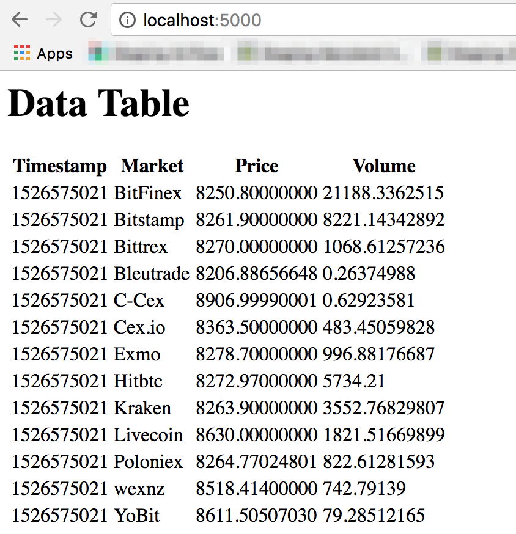

# Docker Python Test
This is a broken application. The goal is to run this Flask application using Docker.

# Working Application
The working application displays a simple HTML table. The Flask server makes a request to https://api.cryptonator.com/api/full/btc-usd to get Bitcoin pricing. That data is sent from the server to the clients browser where it is rendered in an HTML Table.

# Errors that need fixing:
1. Building the Docker container will succeed but the application will not run
2. The application runs but no data is displayed in the "Data Table"

:information_source: Fixing each error only requires a 1-line change (e.g. add a line, modify a line)
